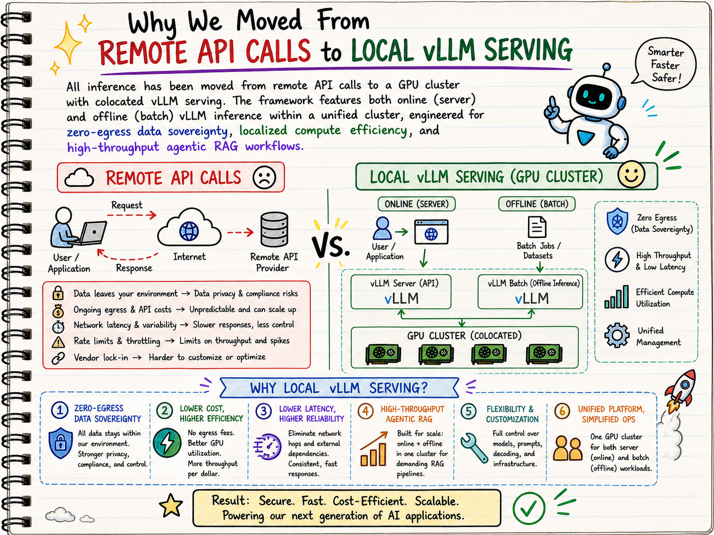
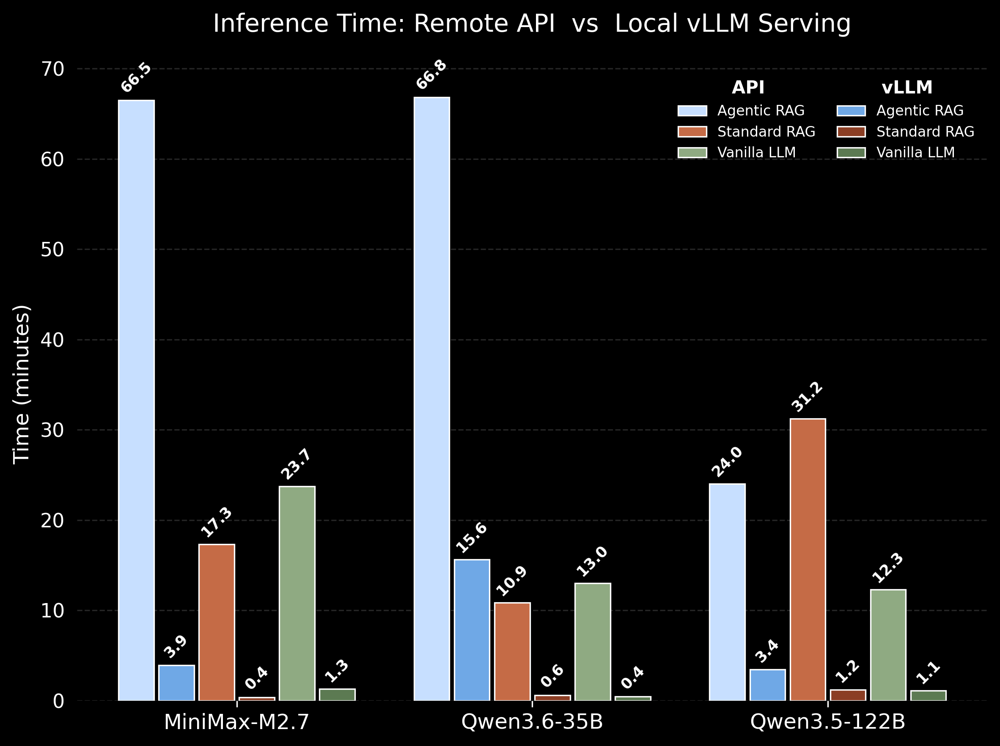

# **Agentic RAG with Colocated vLLM Inference**

## **Project Description**

This project compares the performance of **Agentic RAG**, traditional **RAG**, and **standalone LLM** systems when answering technical questions about the Hugging Face ecosystem.

All inference has been moved from remote API calls to a **GPU cluster with colocated vLLM serving**. The framework features both online (server) and offline (batch) vLLM inference within a unified cluster, engineered for **zero-egress data sovereignty**, localized compute efficiency, and high-throughput RAG workflows.



While traditional RAG systems follow a fixed retrieve-then-generate pattern, this project introduces an **agent-based approach** that enables dynamic decision-making, iterative query refinement, and adaptive tool use. The agent intelligently interacts with external knowledge sources, evaluates retrieved content, and refines its strategy based on outcomes, resulting in more accurate, robust, and contextually rich answers. The agentic framework is built with [smolagents](https://github.com/huggingface/smolagents).


### **Pipeline Architecture**

The evaluation runs as a three-phase hybrid pipeline that maximises GPU utilisation on HPC:

| Phase | Mode | What it does |
|---|---|---|
| **Phase 1** — Offline Batch | `vllm.LLM.generate()` | Standard RAG + Vanilla LLM inference (maximum throughput, zero HTTP overhead) |
| **Phase 2** — Async Server | vLLM server + `asyncio` | Concurrent Agentic RAG — N agents query the vLLM server in parallel; continuous batching keeps GPU near 100% |
| **Phase 3** — Offline Batch | `vllm.LLM.generate()` | LLM-as-judge evaluation of all answers |

### **Key Capabilities**

| Capability | Description |
|---|---|
| **Query Strategy & Refinement** | Strategically determines and combines keywords for search queries, iteratively refining them based on retrieval results to optimize relevance and coverage. |
| **Iterative Query Refinement** | If initial retrieval is insufficient, the agent reformulates queries or expands the number of retrieved documents. |
| **Document Evaluation** | Assesses the relevance and quality of retrieved information relative to the question before generating an answer. |
| **Multi-step Reasoning** | Chains together multiple retrieval and generation steps to answer complex questions. |
| **Self-Correction & Backtracking** | If a generated answer is unsatisfactory, the agent devises and executes alternative retrieval strategies. |

---

## **Installation**

### **Prerequisites**

- Python **3.12+**
- CUDA-capable GPU(s) (tested on NVIDIA H100)
- [vLLM](https://github.com/vllm-project/vllm) (included in requirements)
- Git

### **Steps**

1. **Clone the repository**
   ```bash
   git clone https://github.com/Wen-ChuangChou/Agentic-RAG-vLLM-inference.git
   cd Agentic-RAG-vLLM-inference
   ```

2. **Create and activate a virtual environment** *(recommended)*
   ```bash
   python -m venv .venv
   source .venv/bin/activate
   ```

3. **Install dependencies**
   ```bash
   pip install -r requirement.txt
   ```

4. **Download a model** *(if not already cached)*
   ```bash
   # Example: download a model to the HuggingFace cache
   bash hpc/download_model.sh <model_id>
   ```

---

## **Usage**

### 1. Configure a Model Recipe

Each model is configured via a YAML recipe in `recipes/`. A recipe controls the model, vLLM server, judge, async concurrency, and vector database settings:

```bash
ls recipes/
# GLM-4.7-Flash.yaml  Llama-3.3-70B-Instruct.yaml  MiniMax-M2.7.yaml
# Qwen3.5-122B-A10B-FP8.yaml  Qwen3.6-35B-A3B-FP8.yaml  ...
```

See [`recipes/Qwen3.5-122B-A10B-FP8.yaml`](recipes/Qwen3.5-122B-A10B-FP8.yaml) for a full example with comments.

---

### 2. Run the Evaluation Pipeline

#### **On an HPC cluster (recommended)**

Submit the Slurm job, optionally specifying a recipe:

```bash
# Default recipe (GLM-4.7-Flash)
sbatch hpc/run_agentic_rag.slurm

# Custom recipe
sbatch hpc/run_agentic_rag.slurm recipes/Qwen3.5-122B-A10B-FP8.yaml

# Test mode — run on specific question IDs only
sbatch hpc/run_agentic_rag.slurm recipes/Qwen3.5-122B-A10B-FP8.yaml --test-ids 4 12 20 49 56
```

The Slurm script handles module loading, optional NVMe model staging for faster I/O, and environment variable setup.

#### **Locally**

```bash
python agentic_rag.py --config recipes/GLM-4.7-Flash.yaml

# Test mode — first 5 questions only
python agentic_rag.py --config recipes/GLM-4.7-Flash.yaml --test 5
```

**What the pipeline does:**
1. Builds (or loads from cache) a **FAISS vector database** from the Hugging Face documentation corpus
2. **Phase 1:** Runs Standard RAG and Vanilla LLM via offline batch inference (`vllm.LLM`)
3. **Phase 2:** Launches a vLLM server and runs concurrent Agentic RAG queries via `asyncio`
4. **Phase 3:** Scores all answers with an LLM judge via offline batch inference
5. Saves results to `results/<model_name>_vect<chunk_size>_t<temperature>.json`

> All phases write checkpoints to `checkpoints/` so long runs can be safely resumed.

**Vector database pipeline** (`utils/vectordb_utils.py`):

| Feature | Detail |
|---|---|
| **Parallel splitting** | Documents split concurrently via `ThreadPoolExecutor` for large-scale speed-up |
| **Batch embedding** | Embeds in configurable batches (default 100), merging FAISS shards incrementally to manage memory |
| **Thread-safe processing** | `DocumentProcessor` uses threading locks to prevent race conditions |
| **Intelligent fallback** | Automatically falls back to sequential processing if parallel execution fails |
| **Deduplication** | Removes duplicate documents by content hash before indexing |
| **Persistent caching** | Saves/loads the FAISS index from `vectordb/` to skip expensive recomputation on repeat runs |

> [!TIP]
> **Use a GPU to create the vector store.** Embedding generation is heavily compute-bound: on this dataset a GPU completes the full build in **~14 seconds** (H100), while a CPU takes **more than 23 minutes** (AMD 5600x). If a GPU is available, ensure your `torch` installation is CUDA-enabled — the pipeline will use it automatically.

---

### 3. Visualize Results

#### Performance Scores

Generates a grouped bar chart comparing the mean accuracy (%) of Agentic RAG, Standard RAG, and Vanilla LLM across all result files.

```bash
python visualize_rag_performance.py
python visualize_rag_performance.py --results_dir path/to/results
```

**Output:** `results/evaluation_scores.png`

#### Score Distribution

Generates a stacked bar chart showing the proportion of **Correct**, **Partially correct**, and **Wrong** answers for each system type and model.

```bash
python visualize_correct_portion.py
python visualize_correct_portion.py --results_dir path/to/results
```

**Output:** `results/score_distribution.png`

#### Inference Time Comparison

Compares running time between remote API calls and local vLLM inference serving.

```bash
python visualize_time_comparison.py MiniMax-M2.7 Qwen3.5-122B Qwen3.6-35B
```

**Output:** `results/time_comparison.png`

---

## **Project Structure**

```
Agentic-RAG-vLLM-inference/
│
├── agentic_rag.py                  # Main 3-phase evaluation pipeline
├── visualize_rag_performance.py    # Grouped bar chart of mean accuracy scores
├── visualize_correct_portion.py    # Stacked bar chart of score distribution
├── visualize_time_comparison.py    # API vs vLLM inference time comparison
├── requirement.txt                 # Python dependencies
│
├── recipes/                        # Model configuration recipes (YAML)
│   ├── GLM-4.7-Flash.yaml
│   ├── Llama-3.3-70B-Instruct.yaml
│   ├── MiniMax-M2.7.yaml
│   ├── Qwen3.5-122B-A10B-FP8.yaml
│   └── Qwen3.6-35B-A3B-FP8.yaml
│
├── utils/                          # Core modules
│   ├── agent_tools.py              # RetrieverTool for the smolagents CodeAgent
│   ├── async_agentic_runner.py     # Concurrent agentic RAG via asyncio + threading
│   ├── model_factory.py            # Model creation factory
│   ├── offline_runner.py           # Offline batch inference via vllm.LLM
│   ├── vllm_server_manager.py      # vLLM server lifecycle context manager (Phase 2)
│   ├── checkpoint_runner.py        # Checkpointing logic for long evaluations
│   ├── results_manager.py          # Save / load evaluation results to JSON
│   └── vectordb_utils.py           # FAISS vector database (gte-small embeddings, parallel build, persistent cache)
│
├── hpc/                            # HPC / Slurm scripts
│   ├── run_agentic_rag.slurm       # Main Slurm job script (3-phase pipeline)
│   ├── launch_vllm_server.sh       # Standalone vLLM server launcher
│   ├── launch_vllm_multinode.sh    # Multi-node vLLM server launcher
│   ├── download_model.sh           # Model download helper
│   ├── setup_vllm_env.sh           # vLLM environment setup
│   └── test_phase1.slurm           # Phase 1 unit test job
│
└── prompts/                        # YAML prompt templates
    ├── gemini_agent_system_prompt.yaml
    ├── guide_agent_system_prompt.yaml
    └── evaluation_prompt.yaml

```

---

## **Results**

Performance was evaluated using the [Hugging Face technical Q&A dataset](https://huggingface.co/datasets/m-ric/huggingface_doc_qa_eval) with all inference running on a local GPU cluster via vLLM.

### **Inference Time: API vs Local vLLM**



The API vs. vLLM results show that system design, not just modeling approach, determines whether advanced pipelines are viable. Under remote APIs, latency is dominated by per-call overhead, so Agentic RAG becomes prohibitively slow due to many sequential requests. In contrast, on a local vLLM server, the concurrent Agentic RAG setup—multiple agents issuing requests in parallel—combined with continuous batching keeps GPU utilization near saturation and amortizes decoding costs across requests. This collapses end-to-end latency by an order of magnitude and makes multi-step reasoning pipelines not only feasible but efficient.

For Standard RAG and Vanilla LLM, the use of offline batching further highlights this systems effect. While APIs penalize even modest multi-call workflows, local batching executes large query sets in parallel with minimal overhead, bringing their runtimes close to the lower bound of pure model compute. As a result, the latency gap between Standard RAG and Vanilla LLM nearly disappears locally, while Agentic RAG remains somewhat higher due to additional steps—but still within a practical range. Overall, we demonstrate that concurrency + batching (either in agentic, RAG, or Vanilla LLM) are the key enablers, transforming both simple and complex pipelines from API-limited latency regimes into compute-efficient, high-throughput local systems.

---

## **References**

1. [vLLM — Easy, fast, and cheap LLM serving](https://github.com/vllm-project/vllm)
2. [smolagents — Hugging Face agent framework](https://github.com/huggingface/smolagents)